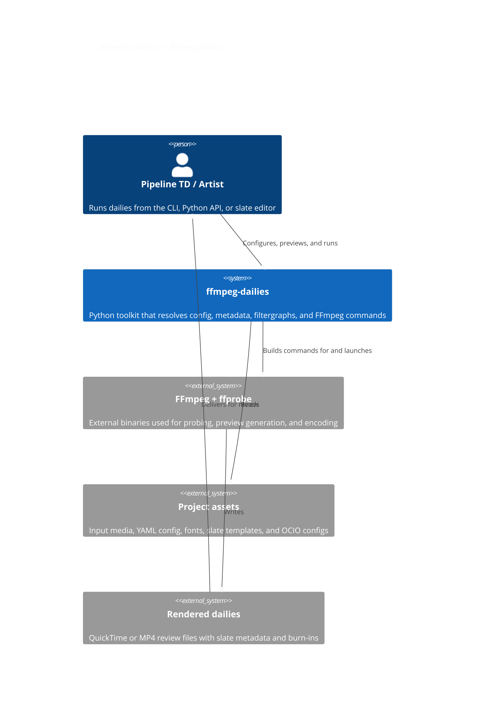
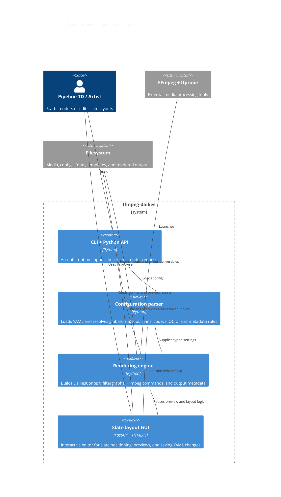
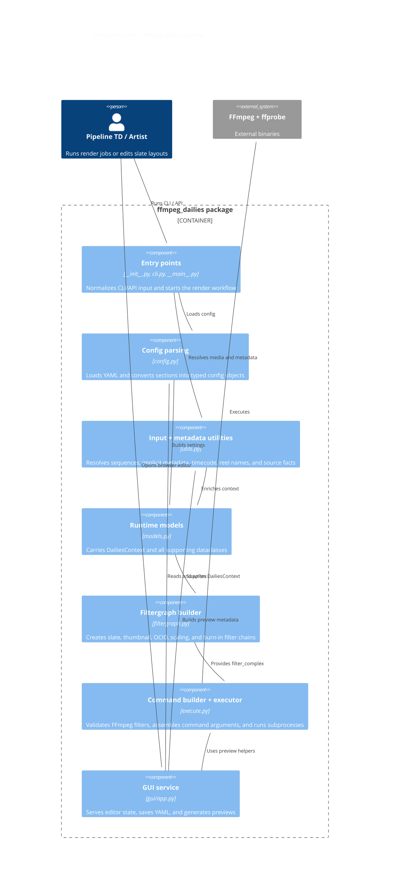

# C4 Mermaid Diagrams

These diagrams describe the repository from three useful viewpoints: system context, container responsibilities, and internal Python components.

## 1. System context

**Reading tip:** the toolkit itself is the orchestration layer; FFmpeg remains the execution engine.

## 2. Container view

**Reading tip:** the GUI is a companion container that shares the same parsing and preview logic instead of re-implementing rendering rules.

## 3. Component view

**Reading tip:** `models.py` is the shared contract between parsing, utility, filtergraph, and execution layers.
