# Graph Diagrams

These rendered graph diagrams replace the earlier embedded Mermaid blocks with more controlled layouts and checked-in static output.

The checked-in `docs/diagrams/puppeteer-config.json` disables the Chromium sandbox because Mermaid CLI often runs in restricted CI or container environments where the sandbox cannot start. If your local machine supports the default sandbox, you can omit `-p docs/diagrams/puppeteer-config.json`.

## 1. System context



- Source: [`docs/diagrams/system-context.mmd`](./diagrams/system-context.mmd)
- Focus: who uses the toolkit, what inputs it consumes, and how FFmpeg produces review outputs

## 2. Runtime containers



- Source: [`docs/diagrams/runtime-containers.mmd`](./diagrams/runtime-containers.mmd)
- Focus: interface layer, core services, preview/editor flow, and external dependencies

## 3. Component flow



- Source: [`docs/diagrams/component-flow.mmd`](./diagrams/component-flow.mmd)
- Focus: how the package modules cooperate from entry points through execution

## Regenerating the SVGs

```bash
cd "$(git rev-parse --show-toplevel)"
for name in system-context runtime-containers component-flow; do
  npx -y @mermaid-js/mermaid-cli \
    -p docs/diagrams/puppeteer-config.json \
    -i "docs/diagrams/${name}.mmd" \
    -o "docs/diagrams/rendered/${name}.svg"
done
```
